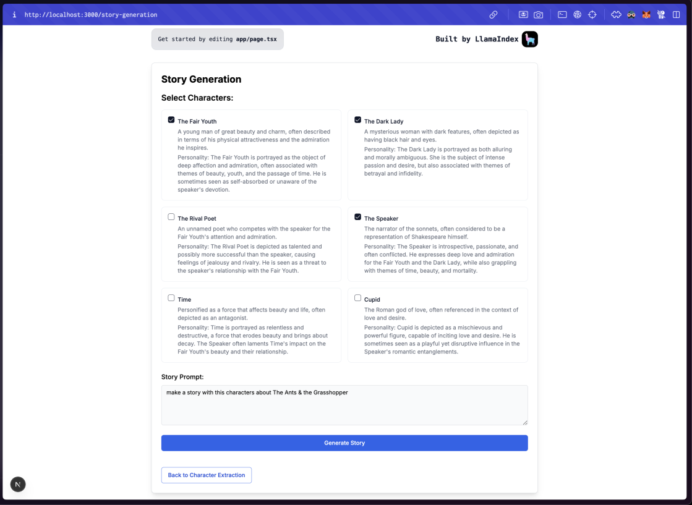

# Character Extraction and Story Generator

## Project Description
A Next.js application that extracts characters from uploaded text files and uses them to generate new stories. Built on the LlamaIndex TypeScript Toolset, this app implements a RAG pipeline to identify character names, descriptions, and personalities from books or stories, then presents them in a structured format for creative reuse.

## Features
- **File Upload**: Support for `.txt` files containing stories with characters
- **Character Extraction**: Automated extraction using RAG pipeline
- **Structured Output**: Characters displayed in table format with name, description, and personality
- **Story Generation**: Create new stories using extracted characters
- **Genre & Tone Selection**: Customize story generation parameters

## Tech Stack
- Next.js
- LlamaIndex TypeScript Toolset
- RAG (Retrieval Augmented Generation)

## Setup Instructions

### Prerequisites
- Node.js v20+
- LLM Loader / text-generation-webui with API enabled

### Installation
```bash
git clone https://github.com/your-username/character-extraction-story-generator
cd character-extraction-story-generator
cd rag-app
touch .env
npm install
npm run dev
```
don't forget to add your API key in the `.env` file.
```
OPENAI_API_KEY=REPLACE_WITH_YOUR_OPENAI_API-KEY
```

## Usage
1. Upload a `.txt` file containing a book or story
2. Click "Extract Characters" to process the file
3. Review extracted characters in the table
4. Select characters to use in a new story
5. Generate stories using these characters

## RAG Pipeline
- Document loading and chunking
- Semantic indexing of text
- Character information extraction
- Structured output formatting

## Project Report
When users go to the Character Extraction page, they can upload a text file containing a story.
The app will then extract characters from the text and display them.
Users can select characters to use in a new story.


Users can select characters from the extracted characters and generate a new story.
They can also input the genre and tone of the story in the story prompt.


The app will then generate a new story using the selected characters and the user input.


## Model Testing
Capability to test and compare different AI models for:
- Character extraction accuracy
- Story generation quality
- Context window optimization

## Contributors
- joyjsmun (Unique ID: OFVwFA)
- ifanzalukhu97 (Unique ID: S3lFve)
- nvinnikov (Unique ID: VvZfPu)
- Add more contributors...

*This project builds upon our "Story Telling App" developed last week.*
